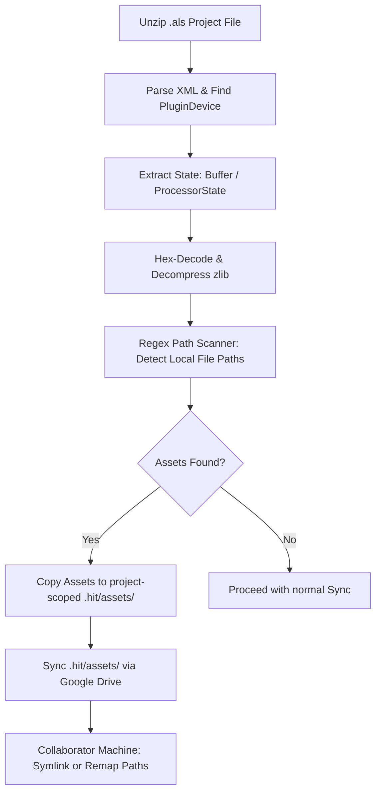

# Ableton Live VST & AU Plugin Synchronization Specification

This specification outlines the technical design for managing third-party VST2, VST3, and Audio Unit (AU) plugins within **HIT**, the Git + Google Drive sync manager for DAW projects. It details the file formats, XML structures, state serialization mechanisms, missing plugin detection algorithms, and asset synchronization workflows.

---

## 1. Executive Summary

In collaborative music production, project sharing is frequently disrupted by:
1. **Missing Plugins**: Collaborators may not have the same plugins installed.
2. **Format Discrepancies**: One collaborator uses Audio Units (macOS only) while another uses VST (cross-platform), or one uses VST2 and another VST3.
3. **Missing External Assets**: Custom wavetables, samples (e.g., Kontakt), and user presets are not bundled in the `.als` file.
4. **State Destruction**: Opening a project with missing plugins in some DAWs can permanently strip that plugin's state when saving.

**HIT** resolves these issues by parsing the Ableton Live Set (`.als`) XML offline to verify plugin compatibility, back up plugin states, extract external asset paths, and sync assets automatically via Google Drive.

---

## 2. Ableton Live Set (.als) XML Plugin Storage Architecture

Ableton Live Sets (`.als`) are **Gzip-compressed XML** files. When decompressed, they reveal a structured XML tree. Third-party plugins are represented as `<PluginDevice>` elements within track device chains.

### 2.1. VST2 Plugins (`VstPluginInfo`)
VST2 plugins are identified in the XML by a `<VstPluginInfo>` element under `<PluginDevice> -> <PluginDesc>`.

#### XML Structure Example:
```xml
<PluginDevice>
  <UserName Value="" />
  <PluginDesc>
    <VstPluginInfo Id="0">
      <PlugName Value="Serum" />
      <UniqueId Value="1483109208" />
      <Path Value="/Library/Audio/Plug-Ins/VST/Serum.vst" />
      <VstVersion Value="2400" />
      <Category Value="2" />
      <Preset>
        <VstPreset Id="0">
          <UniqueId Value="1483109208" />
          <Buffer>7801ED5C7B7054D519FF36104882F20812DCF0C8...</Buffer>
          <ParameterCount Value="315" />
          <PluginVersion Value="1" />
        </VstPreset>
      </Preset>
    </VstPluginInfo>
  </PluginDesc>
</PluginDevice>
```

#### Metadata Extraction:
*   **Name**: Found in `<PlugName Value="..." />`.
*   **Plugin Unique ID**: Found in `<UniqueId Value="..." />` (represented as a 32-bit signed decimal integer). 
    *   *Conversion*: To retrieve the standard VST2 4-character identifier, convert the integer to a 4-byte big-endian byte array and decode it as ASCII.
    *   *Example*: `1483109208` -> Hex `0x58664558` -> Bytes `[0x58, 0x66, 0x45, 0x58]` -> ASCII `'XfEX'` (Serum).
*   **Path**: Found in `<Path Value="..." />`. This indicates where the plugin was located on the author's machine.
*   **Plugin State**: Stored inside `<Buffer>` within `<VstPreset>`.
    *   *Encoding*: Hexadecimal representation of a **zlib-compressed binary blob**.
    *   *Extraction*: Convert the hex string to binary, then decompress using zlib. The resulting decompressed data is the raw plugin state block (FXB/FXP structure).

---

### 2.2. VST3 Plugins (`Vst3PluginInfo`)
VST3 plugins use a different structure that reflects the VST3 SDK's separation of processor (DSP) and controller (GUI/parameters) states.

#### XML Structure Example:
```xml
<PluginDevice>
  <UserName Value="" />
  <PluginDesc>
    <Vst3PluginInfo Id="0">
      <Name Value="Serum 2" />
      <Uid>
        <Fields.0 Value="1448297816" />
        <Fields.1 Value="1718833267" />
        <Fields.2 Value="1701999981" />
        <Fields.3 Value="540147712" />
      </Uid>
      <DeviceType Value="1" />
      <Preset>
        <Vst3Preset Id="0">
          <Uid>
            <Fields.0 Value="1448297816" />
            <Fields.1 Value="1718833267" />
            <Fields.2 Value="1701999981" />
            <Fields.3 Value="540147712" />
          </Uid>
          <ProcessorState>586665724A736F6E00B7000000000000007B22636F6D70...</ProcessorState>
          <ControllerState>586665724A736F6E00FB000000000000007B22636F6D70...</ControllerState>
        </Vst3Preset>
      </Preset>
    </Vst3PluginInfo>
  </PluginDesc>
</PluginDevice>
```

#### Metadata Extraction:
*   **Name**: Found in `<Name Value="..." />`.
*   **VST3 Class ID (UID)**: Represented as four 32-bit signed integers under the `<Uid>` element.
    *   *Reconstruction*: Convert each of the four fields (`Fields.0` to `Fields.3`) into 4-byte big-endian values, concatenate them to form a 16-byte array (128-bit GUID), and format it as a standard UUID.
    *   *Example*:
        *   `Fields.0 = 1448297816` -> Hex `56535458`
        *   `Fields.1 = 1718833267` -> Hex `66785473`
        *   `Fields.2 = 1701999981` -> Hex `6572556d`
        *   `Fields.3 = 540147712`  -> Hex `20300000`
        *   *Resulting UUID*: `56535458-6678-5473-6572-556d20300000` (Serum VST3).
*   **Plugin State**: Split into two nodes under `<Vst3Preset>`: `<ProcessorState>` and `<ControllerState>`.
    *   *Encoding*: **Raw hex-encoded binary streams** (not compressed by zlib, though the plugin itself may compress its own internal payload, such as Serum's `XferJson` prefix).
    *   *Extraction*: Convert the hex string directly to bytes. These match the data written/read by the VST3 plugin's `IComponent::getState()` and `IEditController::getState()` methods respectively.

---

### 2.3. Audio Unit (AU) Plugins (`AuPluginInfo`)
Audio Units are macOS-specific and are identified by `<AuPluginInfo>` under `<PluginDevice> -> <PluginDesc>`.

#### XML Structure Example:
```xml
<PluginDevice>
  <UserName Value="" />
  <PluginDesc>
    <AuPluginInfo Id="0">
      <Name Value="Serum" />
      <ComponentType Value="1635086709" />
      <ComponentSubType Value="1399157357" />
      <ComponentManufacturer Value="1483109234" />
      <Preset>
        <AuPreset Id="0">
          <Buffer>7801ED5C7B7054D519FF...</Buffer>
          <Type Value="1635086709" />
          <SubType Value="1399157357" />
          <Manufacturer Value="1483109234" />
        </AuPreset>
      </Preset>
    </AuPluginInfo>
  </PluginDesc>
</PluginDevice>
```

#### Metadata Extraction:
*   **Name**: Found in `<Name Value="..." />`.
*   **AU Identifiers**: Stored as 32-bit signed integers representing Apple's 4-character codes:
    *   `ComponentType`: CoreAudio type code (e.g., `aufx` = effect, `aumu` = instrument).
        *   *Example*: `1635086709` -> Hex `61756D75` -> ASCII `'aumu'`.
    *   `ComponentSubType`: Unique identifier for the specific plugin.
        *   *Example*: `1399157357` -> Hex `5365726D` -> ASCII `'Serm'`.
    *   `ComponentManufacturer`: Developer identifier code.
        *   *Example*: `1483109234` -> Hex `58666572` -> ASCII `'Xfer'`.
*   **Plugin State**: Stored in `<Buffer>` inside `<AuPreset>`.
    *   *Encoding*: Hexadecimal representation of a **zlib-compressed binary plist** (Property List).
    *   *Extraction*: Hex-decode the buffer, decompress via zlib, and parse the resulting plist file. The plist typically contains standard CoreAudio keys (like `jucePluginState` or generic plugin data).

---

## 3. Handling Plugin State & Standalone Preset Files

When syncing projects, it is highly beneficial to extract the active plugin state and write it as a standalone preset file. This enables:
*   **Cross-platform fallback**: Loading the preset manually if the plugin fails to load automatically.
*   **Format translation**: Rebuilding a preset from an AU device and loading it into a VST device.

### 3.1. Rebuilding Standalone Presets

| Plugin Format | Output File Extension | Preset Packaging Rules |
| :--- | :--- | :--- |
| **VST2** | `.fxp` (preset) or `.fxb` (bank) | Prepend the standard 56-byte Steinberg FXP header (`'opaque chunk'` or `'regular parameters'` format) to the decompressed `<Buffer>` bytes. The header must contain the VST2 `UniqueId`. |
| **VST3** | `.vstpreset` | Wrap the `<ProcessorState>` and `<ControllerState>` bytes inside the Steinberg VST3 binary container format. The container includes class ID matching records and binary chunks. |
| **AU** | `.aupreset` | Generate an XML Plist file containing `<key>type</key><string>aumu</string>`, `<key>subtype</key><string>Serm</string>`, `<key>manufacturer</key><string>Xfer</string>`, and `<key>data</key><data>[Base64 State]</data>`. |

---

## 4. External Asset Detection & Synchronization

Plugins often depend on external assets (wavetables, impulse responses, sample libraries, user presets) stored in local user directories. Collaborators opening the project will experience silent tracks or load errors if they lack these assets.



### 4.1. Path Discovery Algorithm (Scraper)
Since Ableton does not store plugin asset paths in its own XML structure, HIT must extract these paths from the **deserialized plugin state**:
1. **Decompress State**: Extract and decompress the plugin state (`<Buffer>` or `<ProcessorState>`).
2. **String Extraction**: Perform a regex scan over the decompressed binary data looking for file paths:
    *   **macOS / POSIX Regex**: `/(?:Users|Library|System|Volumes)/[^ \x00-\x1F\x7F"\']+(?:\.[a-zA-Z0-9]+)?`
    *   **Windows Regex**: `[a-zA-Z]:\\[^ \x00-\x1F\x7F"\']+(?:\.[a-zA-Z0-9]+)?`
3. **Asset Resolution**: Check if the extracted path exists on the local machine. If it does, mark it as a project dependency.

### 4.2. Asset Sync Workflow via Google Drive
1. **Stage Assets**: Copy detected external assets into a project-scoped directory: `.hit/assets/plugins/<PluginName>/<AssetHash>/<Filename>`.
2. **Index Map**: Maintain a local JSON manifest `.hit/asset_map.json` mapping original paths to project-relative paths.
3. **Sync**: Push the staged assets to Google Drive.
4. **Resolve on Remote**: When a collaborator pulls the project:
    *   The HIT daemon reads `.hit/asset_map.json`.
    *   It places the assets into matching directories on the collaborator's machine, or creates symbolic links (e.g., symlinking a custom wavetable folder into the user's local Serum installation directory).

---

## 5. Missing Plugin Detection & Handling

### 5.1. Ableton Live's Default Behavior
When Ableton Live opens a project containing a plugin that is not installed on the system:
1. **Warning Alert**: Live shows a startup notification warning that plugins are missing.
2. **Device State Preservation**: Live wraps the missing plugin in a grayed-out generic device. **Crucially, Ableton does not discard the plugin's XML state.**
3. **Safe Saving**: If the user saves the project, the `<PluginDevice>` structure and its serialized `<Buffer>` state are written back to the `.als` file unmodified. 
4. **Resolution**: Once the missing plugin is installed, it will load perfectly with all custom settings restored.

### 5.2. HIT Pre-flight Verification Workflow
To prevent surprises, the HIT daemon performs a "pre-flight check" when a collaborator pulls a set.

```
                  ┌──────────────────────────────┐
                  │      Parse Incoming .als     │
                  └──────────────┬───────────────┘
                                 │
                                 ▼
                  ┌──────────────────────────────┐
                  │   Extract Plugin Metadata    │
                  │   (Name, UniqueId, Uid, AU)  │
                  └──────────────┬───────────────┘
                                 │
                                 ▼
                  ┌──────────────────────────────┐
                  │ Query System Plugin Registry │
                  └──────────────┬───────────────┘
                                 │
                        Is Plugin Installed?
                       ┌─────────┴─────────┐
                    No │               Yes │
                       ▼                   ▼
        ┌─────────────────────────────┐  ┌─────────────────────┐
        │   Warn User & Offer Sync    │  │ Mark Device Ready   │
        │   / Installer Suggestions   │  └─────────────────────┘
        └─────────────────────────────┘
```

#### How HIT Queries Installed Plugins Locally:
*   **VST2**: Scan the standard paths:
    *   macOS: `/Library/Audio/Plug-Ins/VST/` and `~/Library/Audio/Plug-Ins/VST/`
    *   Windows: `C:\Program Files\VSTPlugins\`, `C:\Program Files\Steinberg\VSTPlugins\`, etc.
    *   *Identification*: Parse the headers of `.vst` bundles or `.dll` files to extract the 32-bit VST2 ID and match it to the XML's `UniqueId`.
*   **VST3**: Scan the standard paths:
    *   macOS: `/Library/Audio/Plug-Ins/VST3/` and `~/Library/Audio/Plug-Ins/VST3/`
    *   Windows: `C:\Program Files\Common Files\VST3\`
    *   *Identification*: Query the module database or scan the `.vst3` bundle's internal structure (or `Info.plist` on macOS) to check for class ID matching the VST3 `Uid`.
*   **Audio Units**: Query the macOS Audio Component Manager:
    *   Run command: `auval -a` to list all registered components, or query using CoreAudio APIs.
    *   Check for matching `ComponentType`, `ComponentSubType`, and `ComponentManufacturer` values.

---

## 6. Cross-Platform & Cross-Format Bridge Mapping

Collaborators often work on different platforms (Mac vs Windows) or prefer different plugin formats (AU vs VST). 

### 6.1. Format Translation Rules
1. **AU-to-VST (Mac to Windows)**:
    *   When transferring from macOS to Windows, AU plugins (`AuPluginInfo`) must be mapped to VST equivalent versions.
    *   HIT maintains a lookup table (e.g., Mapping `ComponentSubType` 'Serm' and `ComponentManufacturer` 'Xfer' to VST2 ID `'XfEX'` or VST3 UUID `56535458-6678-5473-6572-556d20300000`).
    *   Since AU states use a `.plist` wrapper and VST states use raw binary buffers, HIT can extract the raw binary state block from the plist (`jucePluginState` or equivalent) and inject it into a VST2 `<Buffer>` or VST3 `<ProcessorState>` structure, allowing cross-platform loading.
2. **VST2-to-VST3 Migration**:
    *   Many modern plugins allow VST3 to import VST2 states automatically, but if Ableton doesn't bridge them, HIT can rewrite the `<PluginDevice>` XML tag dynamically to convert a VST2 device to a VST3 device wrapper, translating the zlib-compressed VST2 buffer into the VST3 `ProcessorState` stream structure.

---

## 7. Step-by-Step Implementation Plan

### Phase 1: ALS Parsing and Metadata Extraction
1. **Implement Gzip Stream Handling**: Read `.als` files, decompress in memory, and parse XML using an incremental parser (e.g., Python's `xml.etree.ElementTree` or `lxml`).
2. **Identify Plugin Devices**: Extract `<PluginDevice>` nodes and categorize them into VST2, VST3, or AU.
3. **Normalize Identifiers**: Write conversion logic to extract human-readable 4-character codes from VST2 and AU integer values, and 128-bit GUIDs from VST3 multi-field elements.

### Phase 2: Local Plugin Verification Daemon
1. **Implement Local Scanner**: Create a background thread in the HIT daemon to scan installed VST2, VST3, and AU plugins on the user's machine.
2. **Build Index Cache**: Store discovered plugin IDs and names in a local cache database (`~/.config/hit/plugin_registry.json`).
3. **Compare and Alert**: On pulling a git commit, extract the list of required plugins from the `.als` and compare it against the local registry. Alert the user of missing plugins via system notifications or the HIT desktop UI.

### Phase 3: Binary State Parser & Asset Sync
1. **Implement State Decoders**:
    *   Hex-decode and decompress VST2/AU state buffers.
    *   Hex-decode VST3 state streams.
2. **Scrape Assets**: Search the decompressed binary data for local absolute file paths using platform-specific regex.
3. **Establish Asset Sync**:
    *   Copy matching files to `.hit/assets/`.
    *   Generate `.hit/asset_map.json`.
    *   Upload staged files to the Google Drive sync container.
4. **Asset Mapping on Pull**: Automatically rewrite file paths in the plugin state before launching Ableton, or configure local symbolic links to point to the synced assets.

### Phase 4: Cross-Format Mapping Integration
1. **Create Bridge Database**: Build an open mapping registry translating Audio Unit sub-types and manufacturers to their respective VST2/3 IDs.
2. **State Translation Engine**: Implement plist-to-binary-chunk conversion algorithms to dynamically replace AU wrappers with VST wrappers when translating projects between macOS and Windows.
